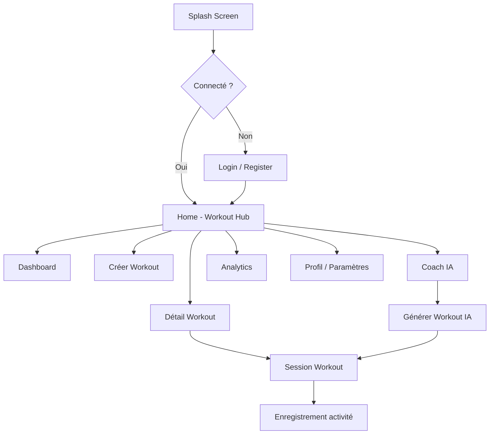

# GymCoach — Documentation du projet


---

## 1. Introduction

Ce document présente l'ensemble du projet **GymCoach**, une application de coaching fitness intelligente développée avec le framework **Flutter**. Il décrit le contexte du projet, les objectifs fonctionnels, l'architecture technique, les fonctionnalités implémentées, ainsi que les perspectives d'évolution.

GymCoach vise à offrir aux sportifs un compagnon numérique capable de proposer des programmes d'entraînement personnalisés, de suivre leur progression et de fournir des conseils adaptés via un coach virtuel alimenté par l'intelligence artificielle. L'application adopte une interface moderne en mode sombre, orientée performance et expérience utilisateur fluide.

---

## 2. À propos du projet

### 2.1 Présentation

**GymCoach** (*Your Intelligent Fitness Coach Powered by AI*) est une application de suivi et d'optimisation de l'entraînement physique. Elle s'adresse aux sportifs de tous niveaux souhaitant structurer leurs séances, analyser leurs performances et bénéficier de recommandations personnalisées.

### 2.2 Objectifs

| Objectif | Description |
|----------|-------------|
| Centraliser l'entraînement | Proposer un catalogue de programmes et la création de séances personnalisées |
| Accompagner l'utilisateur | Fournir un coach IA conversationnel pour les conseils nutrition, récupération et planification |
| Mesurer la progression | Afficher des statistiques de performance et l'historique des activités |
| Personnaliser l'expérience | Permettre la gestion du profil, des préférences et des objectifs hebdomadaires |

### 2.3 Public cible

- Sportifs amateurs et confirmés
- Personnes en quête de perte de poids, prise de masse ou amélioration de l'endurance
- Utilisateurs recherchant un suivi structuré sans dépendre d'un coach physique permanent

---

## 3. Contexte et étude de l'existant

### 3.1 Contexte

Le marché des applications fitness connaît une croissance soutenue. Les utilisateurs attendent des solutions intégrant :

- Des programmes d'entraînement variés et filtrables par objectif
- Un suivi de progression visuel et motivant
- Une assistance intelligente (IA) pour adapter les séances
- Une expérience mobile fluide et esthétique

### 3.2 Analyse de l'existant

| Solution existante | Points forts | Limites |
|-------------------|--------------|---------|
| **Nike Training Club** | Programmes gratuits, interface soignée | Peu de personnalisation IA |
| **Freeletics** | Coaching adaptatif | Modèle freemium restrictif |
| **MyFitnessPal** | Suivi nutritionnel complet | Focus nutrition plutôt qu'entraînement |
| **Strava** | Communauté et suivi cardio | Orienté course/vélo, moins musculation |

### 3.3 Positionnement de GymCoach

GymCoach se distingue par :

1. **L'intégration d'un coach IA** directement dans l'application
2. **Une interface « glass morphism »** moderne et cohérente
3. **La création de séances personnalisées** par l'utilisateur
4. **Un tableau de bord unifié** combinant entraînement, analytics et profil
5. **Une architecture Flutter** permettant le déploiement multiplateforme (Android, iOS, Web, Windows, Linux, macOS)

Le projet constitue une **migration Flutter** (version 2.0.4) d'une application fitness existante, visant une base de code unique et maintenable.

---

## 4. Cahier des charges

### 4.1 Exigences fonctionnelles

| ID | Exigence | Priorité |
|----|----------|----------|
| EF-01 | Authentification (inscription, connexion, mot de passe oublié) | Haute |
| EF-02 | Catalogue de programmes d'entraînement avec filtres par catégorie | Haute |
| EF-03 | Création de séances personnalisées | Haute |
| EF-04 | Exécution guidée d'une séance (session workout) | Haute |
| EF-05 | Coach IA conversationnel avec génération de workout | Haute |
| EF-06 | Tableau de bord et suivi des objectifs hebdomadaires | Moyenne |
| EF-07 | Analytics de progression (périodes 7j / 30j / 6 mois) | Moyenne |
| EF-08 | Historique des activités | Moyenne |
| EF-09 | Gestion du profil utilisateur | Moyenne |
| EF-10 | Notifications et paramètres (unités, préférences) | Basse |
| EF-11 | Écrans informatifs (À propos, Aide, Équipe, Mentions légales) | Basse |

### 4.2 Exigences non fonctionnelles

| ID | Exigence |
|----|----------|
| ENF-01 | Interface responsive et accessible |
| ENF-02 | Thème sombre Material Design 3 |
| ENF-03 | Persistance locale des données utilisateur |
| ENF-04 | Temps de chargement initial < 3 secondes |
| ENF-05 | Architecture modulaire et testable |
| ENF-06 | Compatibilité multiplateforme via Flutter |

### 4.3 Contraintes

- Stockage local via `SharedPreferences` (pas de backend serveur dans la version actuelle)
- Coach IA basé sur des règles métier (simulation), extensible vers une API LLM
- Compte démo : `athlete@gymcoach.com`

---

## 5. Conception de l'application

### 5.1 Architecture générale

L'application suit une architecture en couches inspirée du pattern **Provider** (gestion d'état réactive proche du MVVM) :

```
┌─────────────────────────────────────────────────────────┐
│                      UI Layer                           │
│  Screens (20+)  │  Widgets réutilisables (GlassCard…)   │
├─────────────────────────────────────────────────────────┤
│                   State Layer                           │
│  AuthProvider │ WorkoutProvider │ AnalyticsProvider     │
│  SettingsProvider │ NotificationsProvider                 │
├─────────────────────────────────────────────────────────┤
│                  Service Layer                          │
│  AuthService │ WorkoutService │ AiCoachService          │
│  AnalyticsService │ SettingsService │ StorageService    │
├─────────────────────────────────────────────────────────┤
│                   Data Layer                            │
│  Models (UserProfile, WorkoutCard, ActivityRecord…)     │
│  SharedPreferences (persistance locale)                 │
└─────────────────────────────────────────────────────────┘
```

### 5.2 Organisation des dossiers

```
lib/
├── constants/      # Couleurs, typographie, routes, assets
├── models/         # Modèles de données
├── providers/      # Gestion d'état (ChangeNotifier)
├── screens/        # Écrans de l'application
├── services/       # Logique métier et accès aux données
├── utils/          # Validateurs, helpers, navigation
├── widgets/        # Composants UI réutilisables
└── main.dart       # Point d'entrée et configuration des routes
```

### 5.3 Navigation

L'application utilise un système de routes nommées (`AppRoutes`) avec une barre de navigation inférieure à 5 onglets :

| Onglet | Route | Écran |
|--------|-------|-------|
| Training | `/home` | Workout Hub |
| About | `/about` | Présentation de l'app |
| Insights | `/progress-analytics` | Analytics de progression |
| Coach | `/ai-coach` | Coach IA |
| Profile | `/profile` | Profil utilisateur |

### 5.4 Modèle de données principal

- **UserProfile** : nom, email, poids, taille
- **WorkoutCardData** : titre, description, durée, intensité, catégorie, exercices
- **WorkoutExercise** : nom, séries/répétitions, icône
- **ActivityRecord** : séance complétée, date, durée, calories
- **ChatMessage** : messages du coach IA
- **AppSettings** : notifications, unités métriques

### 5.5 Diagramme de flux utilisateur



---

## 6. Technologies utilisées

### 6.1 Stack technique

| Technologie | Version | Rôle |
|-------------|---------|------|
| **Flutter** | SDK ^3.6.1 | Framework UI multiplateforme |
| **Dart** | ^3.6.1 | Langage de programmation |
| **Provider** | ^6.1.2 | Gestion d'état réactive |
| **SharedPreferences** | ^2.3.5 | Persistance locale clé-valeur |
| **Google Fonts** | ^6.2.1 | Typographie personnalisée |
| **Cached Network Image** | ^3.4.1 | Chargement et cache d'images réseau |

### 6.2 Outils de développement

| Outil | Usage |
|-------|-------|
| **flutter_lints** | Analyse statique et conventions de code |
| **flutter_test** | Tests unitaires et widget tests |
| **Material Design 3** | Système de design (thème sombre) |

### 6.3 Plateformes cibles

- Android
- iOS
- Web
- Windows
- Linux
- macOS

---

## 7. Implémentation

### 7.1 Point d'entrée (`main.dart`)

Au démarrage, l'application :

1. Initialise les providers (`AuthProvider`, `WorkoutProvider`, `SettingsProvider`)
2. Charge les données persistées (session, workouts, paramètres)
3. Configure le thème sombre Material 3
4. Enregistre toutes les routes nommées

### 7.2 Couche Services

| Service | Responsabilité |
|---------|----------------|
| `StorageService` | Lecture/écriture SharedPreferences (profil, utilisateurs, activités, workouts) |
| `AuthService` | Login, inscription, réinitialisation mot de passe, connexion sociale simulée |
| `WorkoutService` | Catalogue seed, filtrage, création custom, complétion de session |
| `AiCoachService` | Génération de réponses par mots-clés, création de workout IA |
| `AnalyticsService` | Données de performance par période |
| `SettingsService` | Persistance des préférences utilisateur |

### 7.3 Couche Providers

Les providers exposent l'état aux widgets via `context.watch()` et notifient les changements avec `notifyListeners()` :

- **AuthProvider** : état de connexion, profil courant
- **WorkoutProvider** : liste des workouts, filtres, activités, objectif hebdomadaire
- **AnalyticsProvider** : période sélectionnée, données courantes
- **SettingsProvider** : notifications, unités métriques
- **NotificationsProvider** : liste et gestion des notifications

### 7.4 Composants UI réutilisables

| Widget | Description |
|--------|-------------|
| `GlassCard` | Carte avec effet verre (glass morphism) |
| `BottomNavBar` | Navigation inférieure à 5 onglets |
| `GymCoachHeader` | En-tête standardisé des écrans |
| `GymImage` | Affichage d'images locales ou réseau avec cache |
| `FilterChipBar` | Barre de filtres par catégorie/période |
| `FormWidgets` | Champs de formulaire stylisés (login, register) |

### 7.5 Design System

- **Couleurs** : palette sombre avec accent vert primaire (`AppColors`)
- **Typographie** : hiérarchie display / headline / body / label (`AppTypography`)
- **Espacements** : grille cohérente (`AppSpacing`)

---

## 8. Fonctionnalités développées

### 8.1 Authentification

- Écran de connexion avec validation des champs
- Inscription avec captcha intégré
- Réinitialisation du mot de passe
- Compte démo et persistance de session
- Écran splash avec redirection conditionnelle

### 8.2 Workout Hub (Accueil)

- Catalogue de programmes prédéfinis : *Hypertrophy Max*, *Metabolic Shred*, *Endurance Engine*, etc.
- Filtres : All Programs, Mass, Weight Loss, Endurance
- Recommandation quotidienne
- Accès rapide au Dashboard
- Bouton flottant pour créer une séance

### 8.3 Création et exécution de séances

- **Create Workout** : formulaire de création (titre, description, durée, intensité, catégorie)
- **Workout Detail** : aperçu des exercices et métadonnées
- **Workout Session** : déroulement guidé exercice par exercice avec barre de progression
- Enregistrement automatique dans l'historique à la fin de la session

### 8.4 Coach IA

- Interface de chat conversationnel
- Réponses contextuelles (jambes, récupération, nutrition, HIIT, planification)
- Saisie vocale simulée via bottom sheet
- Bouton **GENERATE FULL WORKOUT** produisant une séance *Plyometric-Power Cluster*
- Indicateur de récupération (88%) et données biométriques simulées

### 8.5 Dashboard

- Niveau utilisateur et message d'accueil personnalisé
- Progression hebdomadaire (sessions / objectif)
- Dernières activités
- Accès rapide aux séances

### 8.6 Analytics de progression

- Sélection de période : 7 jours, 30 jours, 6 mois
- Graphiques de performance musculaire
- Suivi du poids et records personnels (Deadlift, Bench Press, Squat)
- Distribution d'entraînement par jour de la semaine

### 8.7 Profil et paramètres

- Édition du profil (nom, email, poids, taille)
- Paramètres : notifications push, unités métriques
- Configuration de l'objectif hebdomadaire de séances
- Liens vers Aide, Équipe, Mentions légales

### 8.8 Notifications

- Centre de notifications avec différents types (rappel workout, insight IA, record)
- Navigation contextuelle depuis une notification

### 8.9 Historique des activités

- Liste chronologique des séances complétées
- Détails : titre, date, durée, intensité

---

## 9. Tests et validation

### 9.1 Tests automatisés

Un test widget de base est implémenté dans `test/widget_test.dart` :

- Vérifie le chargement de l'écran splash
- Confirme la présence du texte « GYMCOACH »

```bash
flutter test
```

### 9.2 Validation manuelle

| Scénario | Résultat attendu |
|----------|------------------|
| Connexion avec compte démo | Redirection vers Home |
| Filtrage des workouts par catégorie | Liste filtrée correctement |
| Création d'un workout custom | Apparition dans le catalogue |
| Complétion d'une session | Incrémentation du compteur hebdomadaire |
| Chat avec le coach IA | Réponse contextuelle sous 1 seconde |
| Changement de période analytics | Mise à jour des graphiques |
| Modification des paramètres | Persistance après redémarrage |

### 9.3 Analyse statique

```bash
flutter analyze
```

Le projet utilise `flutter_lints` pour garantir la conformité aux bonnes pratiques Dart/Flutter.

---

## 10. Déploiement

### 10.1 Prérequis

- Flutter SDK ≥ 3.6.1
- Dart SDK ≥ 3.6.1
- Android Studio / Xcode (selon la plateforme cible)

### 10.2 Installation et exécution

```bash
# Cloner le projet et installer les dépendances
cd gymcoach
flutter pub get

# Lancer en mode développement
flutter run

# Lancer sur une plateforme spécifique
flutter run -d chrome      # Web
flutter run -d windows     # Windows
flutter run -d android     # Android
```

### 10.3 Build de production

```bash
# Android (APK)
flutter build apk --release

# Android (App Bundle)
flutter build appbundle --release

# iOS
flutter build ios --release

# Web
flutter build web --release

# Windows
flutter build windows --release
```

### 10.4 Configuration

| Fichier | Rôle |
|---------|------|
| `pubspec.yaml` | Dépendances et assets |
| `android/app/build.gradle` | Configuration Android |
| `ios/Runner/Info.plist` | Configuration iOS |
| `assets/images/` | Images locales de l'application |

---

## 11. Difficultés rencontrées

### 11.1 Migration vers Flutter

La migration depuis une stack précédente a nécessité de repenser l'architecture autour du pattern Provider et de recréer l'ensemble des écrans en widgets Flutter natifs, tout en conservant l'identité visuelle (glass morphism, thème sombre).

### 11.2 Persistance locale sans backend

L'absence de serveur backend impose une gestion manuelle de la persistance via `SharedPreferences`. Les données utilisateur, workouts et activités sont sérialisées en JSON, ce qui limite la scalabilité et la synchronisation multi-appareils.

### 11.3 Coach IA simulé

Le coach IA actuel fonctionne par correspondance de mots-clés plutôt que par un modèle de langage réel. Cela permet un prototype fonctionnel rapide, mais limite la richesse et la personnalisation des réponses.

### 11.4 Gestion d'état distribuée

Avec plusieurs providers indépendants, la coordination entre l'état d'authentification, des workouts et des paramètres requiert une initialisation séquentielle au démarrage (`await authProvider.init()`, etc.).

### 11.5 Tests limités

La couverture de tests reste minimale (un seul widget test). L'absence de tests unitaires sur les services et de tests d'intégration représente un risque pour les évolutions futures.

---

## 12. Améliorations futures

### 12.1 Court terme

- [ ] Étendre la couverture de tests (services, providers, navigation)
- [ ] Intégrer une API LLM réelle pour le coach IA (OpenAI, Gemini, etc.)
- [ ] Ajouter la validation côté formulaire pour tous les écrans
- [ ] Implémenter l'onboarding guidé pour les nouveaux utilisateurs

### 12.2 Moyen terme

- [ ] Backend Firebase ou Supabase (authentification, base de données cloud)
- [ ] Synchronisation multi-appareils des workouts et activités
- [ ] Notifications push réelles (Firebase Cloud Messaging)
- [ ] Intégration wearables (Apple Health, Google Fit) pour données biométriques réelles
- [ ] Mode hors-ligne robuste avec cache SQLite

### 12.3 Long terme

- [ ] Fonctionnalités sociales (partage de séances, défis entre amis)
- [ ] Planification nutritionnelle intégrée
- [ ] Reconnaissance vidéo des exercices (computer vision)
- [ ] Marketplace de programmes créés par des coachs certifiés
- [ ] Internationalisation (i18n) multilingue

---

## 13. Conclusion

**GymCoach** constitue une application fitness complète et moderne, développée avec Flutter et architecturée de manière modulaire. Elle répond aux besoins essentiels d'un sportif : accéder à des programmes structurés, exécuter des séances guidées, interagir avec un coach IA, et suivre sa progression via des analytics visuels.

La version 2.0.4 pose des fondations solides grâce à une séparation claire des responsabilités (models / services / providers / screens), un design system cohérent et une persistance locale fonctionnelle. Les principales axes d'évolution concernent l'intégration d'un backend cloud, l'enrichissement du coach IA et l'extension de la couverture de tests.

Le projet démontre la capacité de Flutter à livrer une expérience utilisateur premium sur plusieurs plateformes à partir d'une base de code unique, tout en restant extensible pour les fonctionnalités avancées à venir.

---

*Document généré pour le projet GymCoach — Juin 2026*
